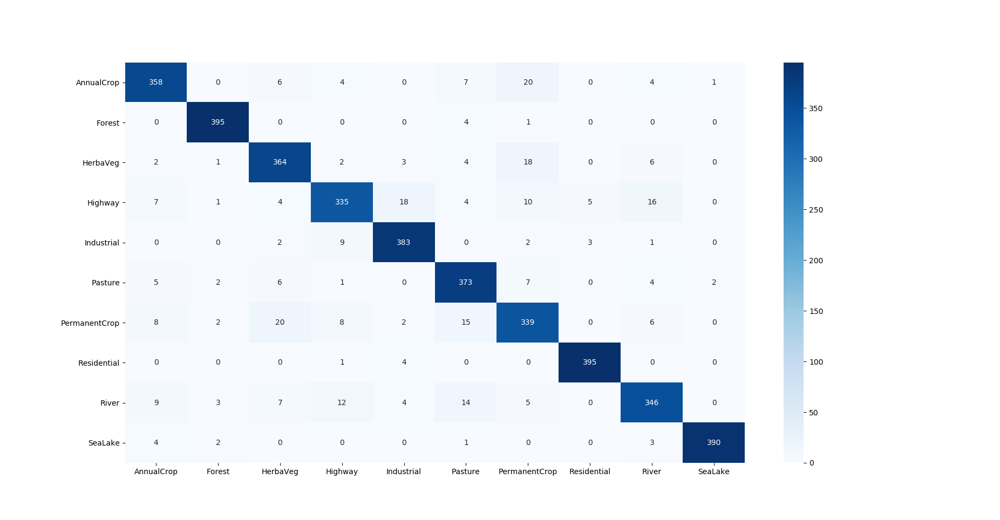

# Land Use and Land Cover Classification

## Getting started

1.  Clone the repo: `git clone https://github.com/alicsalman1/EuroSAT_Classification.git`

2.  Install dependencies:
    ```
    conda create -n land_classification python=3.7
    conda activate land_classification
    pip install -r requirements.txt
    ```
3. Download the dataset: [EuroSAT](http://madm.dfki.de/files/sentinel/EuroSAT.zip )


## Training
Run the following script:
```
python train.py --data_dir <path_to_dataset_folder> \
    --epochs 75 \
    --lr 0.1 \
    --step_lr 30 \
    --batch_size 64 \
    --weight_decay 5e-4 \
    --log_file training.log
```

## Evaluation
If you only want to evaluate a model, run:
```
python train.py --eval_only \
    --model checkpoints/best_model.pth 
```

This will plot the confusion matrix and print the classification report (precision, recall, f1 score, accuracy).


## Inference

Run the following script:
```
python inference.py images/Forest.jpg --model checkpoints/best_model.pth
```

## Results
### Accuracy
|Model|Accuracy|
|:----:|:----:|
ResNet-18|91.95%

### Classification Report

|Class|Precision|Recall|F1-score|
------------ | -------------| -------------| -------------
AnnualCrop      |0.9109  |0.8950  |0.9029
Forest          |0.9729  |0.9875  |0.9801
HerbaVeg        |0.8899  |0.9100  |0.8999
Highway         |0.9005  |0.8375  |0.8679   
Industrial      |0.9251  |0.9575  |0.9410   
Pasture         |0.8839  |0.9325  |0.9075   
PermanentCrop   |0.8433  |0.8475  |0.8454 
Residential     |0.9802  |0.9875  |0.9838  
River           |0.8964  |0.8650  |0.8804  
SeaLake         |0.9924  |0.9750  |0.9836  

### Confusion matrix



## Discussions
